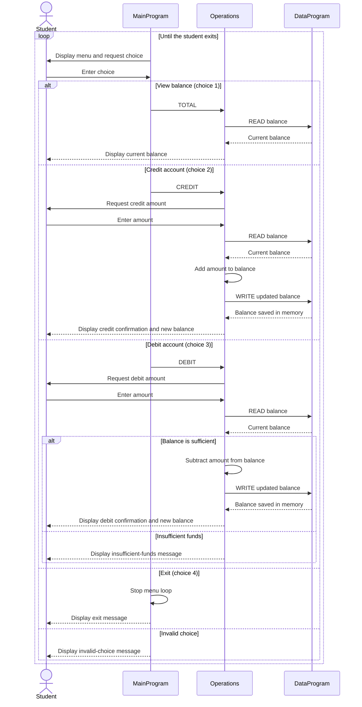

# Student Account Management System

This COBOL sample provides a simple, menu-driven account balance manager. It demonstrates how a main program, an operations module, and a data module work together. The implementation currently manages one shared account balance; it does not identify individual students or maintain separate student accounts.

## COBOL Files

- [`src/cobol/main.cob`](../src/cobol/main.cob) — Defines `MainProgram` and the `MAIN-LOGIC` menu loop. It accepts a choice to view the balance, credit the account, debit the account, or exit, then dispatches supported actions to `Operations`.
- [`src/cobol/operations.cob`](../src/cobol/operations.cob) — Defines `Operations`, which handles balance queries and credit/debit transactions. It prompts for transaction amounts, reads and updates the balance through `DataProgram`, and displays the result or an insufficient-funds message.
- [`src/cobol/data.cob`](../src/cobol/data.cob) — Defines `DataProgram`, the balance storage layer. Its `READ` operation copies the stored balance to the caller, and its `WRITE` operation saves the caller's balance. The balance is held in working storage, not in a file or database.

## Key Operations

`MainProgram` calls `Operations` with a six-character operation code:

- `TOTAL ` reads and displays the current balance.
- `CREDIT` prompts for an amount, adds it to the balance, and saves the result.
- `DEBIT ` prompts for an amount and subtracts it only if the balance is sufficient.

`Operations` calls `DataProgram` with `READ` or `WRITE` to retrieve or persist the balance in memory. `DataProgram` returns to its caller after each request.

## Student Account Business Rules

- The account starts with a balance of `1000.00`.
- The balance and transaction amount use `PIC 9(6)V99`, providing six integer digits and two decimal places. The implied decimal point is not printed as part of the stored numeric value.
- A debit is allowed when the current balance is greater than or equal to the requested amount. If the amount exceeds the balance, no update is made and an insufficient-funds message is displayed. A debit equal to the full balance is allowed.
- Credits are added directly to the balance. The program has no explicit checks for zero or negative amounts, a maximum balance, or other credit restrictions.
- The sample has no student identifiers, per-student balances, account records, or durable storage. The single balance is kept in working storage and is not saved to a file or database.
- Menu choices outside 1 through 4 display an invalid-choice message. Choosing 4 exits the menu loop.

## Application Data Flow

